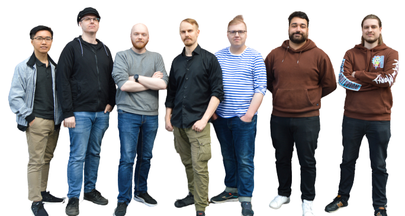
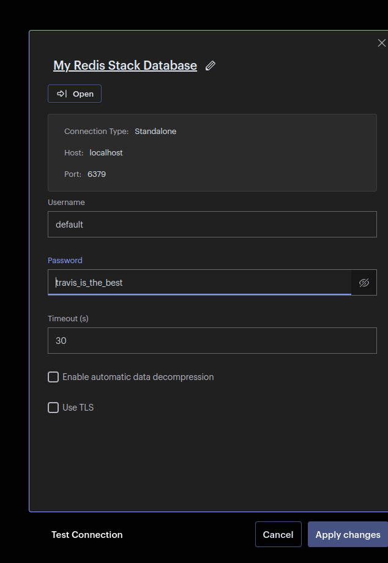
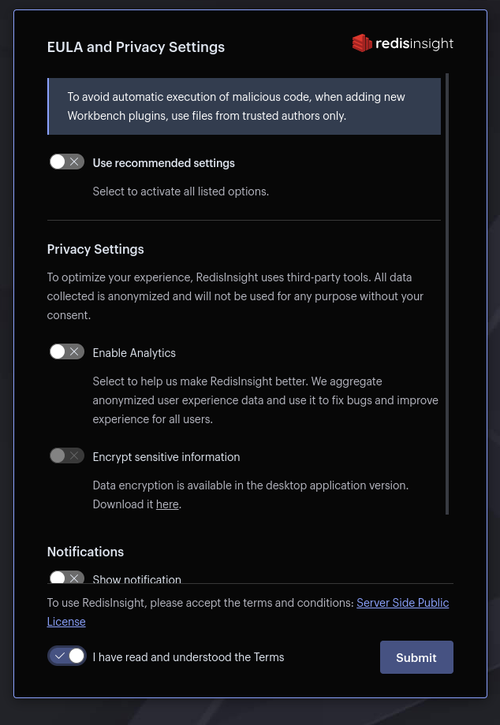
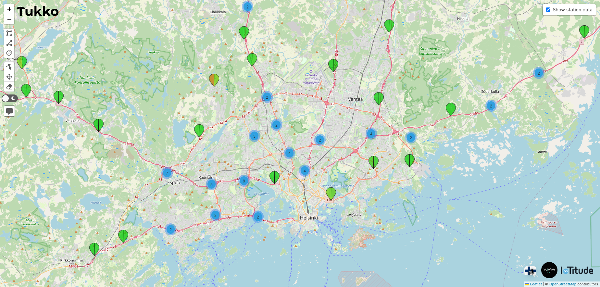

# IoTitude 2023

* We are a virtual company operating under WIMMA Lab of Jyväskylä University of Applied Sciences.
* [Tukko Core - Documentation](https://wimma-lab-2023.pages.labranet.jamk.fi/iotitude/core-traffic-visualizer/)

## WIMMA Lab


* WIMMA Lab is a learning environment where students solve assignments in multidisciplinary project teams.
* Read more at [wimmalab.org](https://www.wimmalab.org/)
* Is a part of Jyväskylä University of Applied Sciences [jamk.fi](https://www.jamk.fi)

# Team Members

| Name | Description | Company / entity Task Responsibilities | LinkedIn |
|:-:|:-:|:-:|:-:|
| [Reima Parviainen](https://gitlab.labranet.jamk.fi/AA6135) | Team Leader | IoTitude /  Lead the project and handle test planning | [LinkedIn](https://www.linkedin.com/in/reima-parviainen) |
| [Justus Hänninen](https://gitlab.labranet.jamk.fi/AB6225) | Junior Developer | IoTitude /  Backend, TypeScript, SFIA DB API | [LinkedIn](https://www.linkedin.com/in/justus-hanninen/) |
| [Hai Nguyen](https://gitlab.labranet.jamk.fi/AA7776) | Junior Developer | IoTitude /  Gitlab Pipeline | [LinkedIn](https://www.linkedin.com/in/hainnp/) |
| [Ilia Chichkanov](https://gitlab.labranet.jamk.fi/AB0189) | Junior Developer | IoTitude /  Backend, SFIA DB API | [LinkedIn](https://www.linkedin.com/in/ilia-chichkanov/) |
| [Olli Kainu](https://gitlab.labranet.jamk.fi/AA4157) | Junior Developer | IoTitude /  Frontend | [LinkedIn](https://www.linkedin.com/in/olli-kainu-930371235) |
| [Otto Nordling](https://gitlab.labranet.jamk.fi/AA4431) | Junior Developer / Tester | IoTitude /  Testing | [LinkedIn](https://www.linkedin.com/in/otto-nordling-67901b277/) |
| [Alan Ousi](https://gitlab.labranet.jamk.fi/AB8823) | Junior Developer / Tester | IoTitude /  Testing | [LinkedIn](https://www.linkedin.com/in/alan-ousi-241218277/) |



# Tukko

Tukko ([*"clog"*](https://en.wiktionary.org/wiki/tukko)) is a traffic visualizer web application build with [React](https://react.dev/)

[](https://react.dev/)[](https://www.mongodb.com/)[](https://www.typescriptlang.org/)[](https://redis.io/)[](https://expressjs.com/)[](https://nodejs.org/)

## Installation

For development environment you will need:
- Your favorite code editor ([vim](https://www.vim.org/), [vscode](https://code.visualstudio.com/), [nano](https://nano-editor.org/))
- Node.js ([v18.16.0 or higher](https://nodejs.org/en/about))
- Node Package Manager ([npm](https://www.npmjs.com/))
    -  **Install:**
        - [Node Version Manager (Recommended)](https://github.com/nvm-sh/nvm)
        - [Download for Windows, macOS, Linux](https://nodejs.org/en/download)
- Git 
    - [Download](https://git-scm.com/download)
- Tukko's backend ([Github](https://github.com/reimbo/tukko-backend))
- Docker for production version ([Docker](https://www.docker.com/))

## Development

```bash
# Use SSH to pull from Github
git pull git@github.com:reimbo/tukko.git
git pull git@github.com:reimbo/tukko-backend.git

# Change working directory to tukkos folder
cd traffic-visualizer
cd traffic-visualizer-backend

# Install node dependencies with npm for both
npm install

# Run frontend development environment with vite
# For backend the same and it runs "npm-run-all -p compose:dev debug"
npm run dev
```

## Production (Docker)

```bash
# For backend install npm-run-all
sudo npm install -g npm-run-all

# Build and run backend containers
# "npm-run-all -p build compose:prod"
npm run prod

# Does the build and makes a Docker image for the frontend and runs it
# localhost:5173
# "docker stop container_name 2>/dev/null || true && docker rm travis --force 2>/dev/null || true && docker build -t travis:latest . && docker run -d --name travis -p 5173:80 travis:latest"
npm run prod
```

### Redis need initialization
* Open Redis UI [http://localhost:8001](http://localhost:8001)



* Check "I have read and understood the Terms" and **Submit**



* Username: **default**
* Password: **travis_is_the_best**
* Click **Apply changes** (a couple of times)


## Usage

* [http://localhost:5173/](http://localhost:5173/)
* Frontend should be running on port 5173. Go and enjoy!

* Click around! Go crazy!

## Contributing

Pull requests are welcome.

## License

[MIT](https://choosealicense.com/licenses/mit/)
